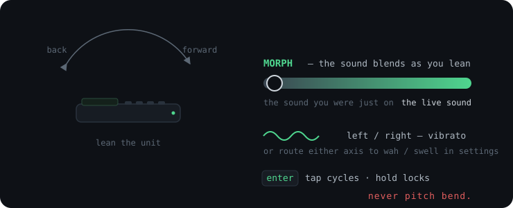
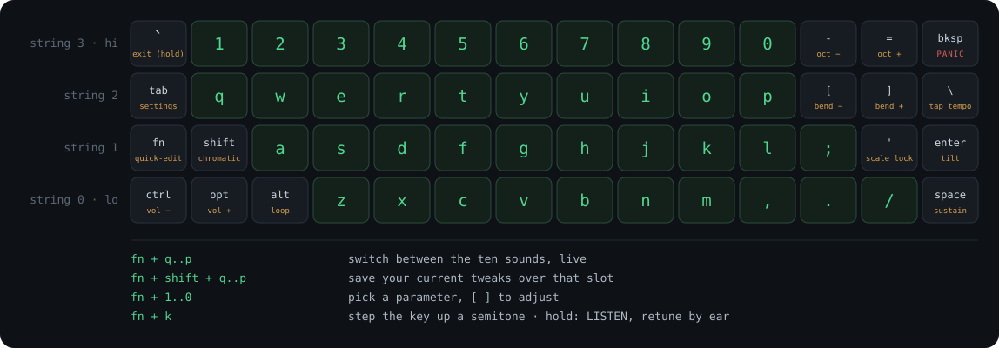
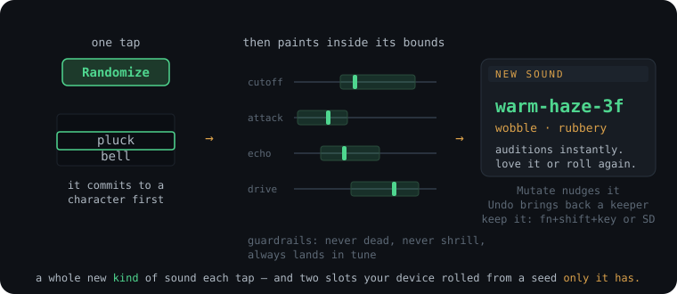

<p align="center">
  
</p>

# GLIDE

**A pocket synth that slides between every note, and builds its own sounds.**
Firmware for the M5Stack Cardputer, original (v1.1) and ADV. By **[CHARL3X](https://github.com/CHARL3X)**.

<p align="center">
  <a href="https://discord.gg/TEr9jCPyNn">
    
  </a>
</p>

<p align="center">
  <em>Share the sounds your device rolled, get help, show what you've made.</em>
</p>

### See it in action

<p align="center">
  <a href="https://www.youtube.com/shorts/P5bjekoP5wY">
    
  </a>
  <br><em><a href="https://www.youtube.com/shorts/P5bjekoP5wY">Watch the demo</a></em>
</p>

<p align="center">
  <a href="https://www.youtube.com/shorts/tIkbVL5VmnQ">
    
  </a>
  <br><em><a href="https://www.youtube.com/shorts/tIkbVL5VmnQ">Watch another demo</a></em>
</p>

GLIDE plays like a fretless string instrument. The key rows are tuned like strings and notes glide between pitches instead of snapping, so you can slide whole chords around and bend into notes right on the keyboard.

And **no two GLIDEs sound alike.** The sounds come from a generative engine: you roll them, evolve them, and keep the ones that hit. Every roll commits to a character first (a pluck, a bell, a pad, an acid squelch, a wobble bass) and then paints inside that character's bounds, so a fresh sound is always playable. The engine also seeds two of your ten slots from a number only your device has, which means your unit sounds like no one else's before you have touched a single setting. This is not an instrument where everyone who owns one sounds the same. That's the point.

<p align="center">
  <a href="https://buymeacoffee.com/charl3x">
    
  </a>
</p>

Two more headline features:

- **Tilt morph.** The gyro is a performance controller. Lean the device forward and back and the sound blends continuously into the one you were just on, or route tilt to vibrato, wah, or swell instead. One `enter` press toggles it, and it follows your hands across every sound.

  

- **It finds a song's key by ear.** Hold `fn`+`k` and the mic listens to whatever's playing in the room, works out the key — root, mode, even the tempo — and retunes the instrument so you can solo over anything. ADV only, since it needs the mic.

  

## Install

GLIDE runs from the microSD card through **[bmorcelli's Launcher](https://github.com/bmorcelli/Launcher)**. Launcher is flashed once; after that, GLIDE and every update is a file you copy to the card.

1. **Flash Launcher first** (one time only). Follow the [Launcher instructions](https://github.com/bmorcelli/Launcher); its web flasher is the easy way. If your Cardputer already runs Launcher, skip this step.
2. **[Download the latest `GLIDE.bin`](https://github.com/CHARL3X/GLIDE-Synth-Cardputer-ADV/releases/latest/download/GLIDE.bin)** and copy it to the `/apps/` folder on the microSD card. That link always points at the newest build; the [Releases page](https://github.com/CHARL3X/GLIDE-Synth-Cardputer-ADV/releases) has the version notes.
3. **Boot → SD → GLIDE.**

No WiFi, no accounts, no setup. Power on, splash (the boot chime is a single note gliding up an octave, played through the synth itself), play.

### Updating

Two ways; copying the file is easier.

- **Copy the new bin.** [Download the latest `GLIDE.bin`](https://github.com/CHARL3X/GLIDE-Synth-Cardputer-ADV/releases/latest/download/GLIDE.bin) and overwrite the old one in `/apps/` on the card. That's the whole update. Saved sounds, tweaks, and settings all survive, since they live in flash outside the app.
- **OTA through Launcher.** Press `esc` (or any key) on Launcher's start screen, open **OTA**, connect to your WiFi, and find **GLIDE** in the list. Launcher downloads and installs the same latest build.

<details>
<summary><strong>Alternative: direct USB flash</strong> (overwrites Launcher)</summary>

For developers building from source: see [building in design.md](docs/design.md#building). Entry procedure: power OFF, hold G0, plug USB-C, release G0. To get Launcher back afterwards, re-flash it.
</details>

## The first five minutes

There's a full HOW TO PLAY screen on the device itself (settings → help), and the complete **[manual](docs/manual.md)** in this repo. But two pictures carry most of it: where everything sits, and where sounds come from.

<p align="center">
  
</p>

<details>
<summary>Plain-text keymap</summary>

```
 string 3 (hi) |  1  2  3  4  5  6  7  8  9  0  |  - oct-   = oct+   bksp PANIC
 string 2      |  q  w  e  r  t  y  u  i  o  p  |  [ bend-  ] bend+  \  tap tempo
 string 1      |  a  s  d  f  g  h  j  k  l  ;  |  ' scale lock      enter tilt
 string 0 (lo) |  z  x  c  v  b  n  m  ,  .  /  |  space sustain

 `     exit (HOLD ~0.7s)     fn (hold)    quick-edit layer
 tab   settings             shift (hold) momentary chromatic
 ctrl/opt volume -/+ (left thumb)        alt loop pedal (left thumb)

 fn + q..p         : switch between the ten sounds, live
 fn + shift + q..p : save your current tweaks over that slot
 fn + 1..0         : pick a parameter, [ ] to adjust
 fn + k            : cycle the key (root) up a semitone (HOLD: listen & retune)
```
</details>

<p align="center">
  
</p>

From there, the first five minutes go like this:

- **Press keys.** It sounds good immediately. Scale lock means every key is a scale tone, no dead notes, and the rows are strings tuned a fourth apart, like a guitar.
- **Hammer-on / pull-off.** Hold a key and tap another on the same row: the voice glides up to it, no re-attack. Release, and it glides back. Each row behaves like a real string.

  
- **Slide a chord.** The same move, with more fingers: hold a shape across rows, then re-finger it a few columns over while the old notes still ring. Every voice glides to its new target. This is the thing.
- **Hold `shift`** to break out of the scale into pure chromatic semitones, only while held. That's the skill gate.
- **Tap the bottom row** to latch drones and chord progressions under your solo (that's the amber row in the picture); **alt** is a one-button loop pedal. A backing band in your left thumb.
- **Roll your own sounds.** `tab` opens settings on two big **Randomize** and **Mutate** buttons — the one-tap roll pictured up top. Every roll auditions instantly, undo/redo means you never lose a keeper, and `fn`+`shift`+letter saves it to a slot, or save it to SD with a name.
- **Tilt the device.** `enter` toggles the gyro: lean forward and back and the sound morphs into the one you were just on; left and right adds vibrato. Rewire either axis in settings.
- **Match whatever's playing.** Hold `fn`+`k` and the mic retunes the instrument to the song's key (ADV): your shapes stay where they are, the notes underneath them move. A single tap of `fn`+`k` changes the key by hand.

  
- Lost? **bksp** is panic (silence everything); hold **`` ` ``** to exit to Launcher.

Everything past that (the looper's overdub stack, the auto-progression, the mod matrix, the full tilt routing) is in the **[manual](docs/manual.md)**.

### Recently

- **Auto key now hears the mode, the home note, and the groove.** Hold `fn`+`k` and LISTEN does more than name a key: it tells Dorian from minor and Mixolydian from major by listening for the notes that separate them, re-seats the tonic when a two-chord vamp fools the textbook reading, and re-centres whatever scale you play (Blues included) on the song's true home. The same capture reads the tempo and locks the jam clock and synced delay to it; a beatless room leaves the tempo alone. The result card names what the song *is*, with the BPM beside it. Shuffle a playlist, hold two keys, solo.
- **The odometer.** Settings keeps a quiet lifetime count of the notes you have struck and your hands-on hours. No goals, no streaks; just the instrument's life with you.
- **The second wave: five new sound characters.** Randomize's archetype pool grows from nine to fourteen: a breathy **slide whistle** that always glides (the instrument's original soul), a **drawbar organ** spinning under a rotary, a **tine piano** for comping, a **wobble bass** whose filter pumps in time with the jam clock, and a **bowed string section** drenched in chorus. Rolls you couldn't get before, guarded by the same never-dead, never-shrill rules. The sound card now names the character each roll commits to, and the two seeded slots on devices you already own keep their exact sounds; the new pool arrives with a fresh seed or your own *Re-roll bank*, never as a side effect of updating.
- **Idle dimming + screensaver.** Leave it sitting and the backlight eases down to save the panel and battery; leave it longer and a phosphor screensaver takes over. The string at rest: a standing wave held across the screen while a soft window of light slides slowly along it, the sound's name whispered underneath. If a loop or jam is still running, the wave answers it. Any key wakes it *and* plays the note, so the first touch is never wasted. Settings → *Screen idle* (off / dim / dim + saver).
- **Auto key detection.** Hold `fn`+`k` and GLIDE listens to a song through the mic, works out its key, and retunes so you can solo straight over it. (ADV only; it needs the mic.)
- **Archetype-driven sound generation.** Randomize now picks a *character* first (pluck, bell, pad, bass, acid, lead, brass, chip, or wild), then paints inside its bounds: real variety per roll, with guardrails so a roll is never dead, blown out, or warbling off-key.
- **Tilt morph (synth blend).** Map tilt to blend continuously between two sounds as you lean the device back and forth.
- **Loop snap.** The looper locks its length to the jam clock, so your loop and the auto-progression share one beat instead of drifting apart.

## Going deeper

The **[manual](docs/manual.md)** covers all of it:

- **[Your sounds are yours](docs/manual.md#your-sounds-are-yours)**: the ten slots, the two seeded generative slots unique to your unit, Randomize / Mutate / undo, and the unlimited SD library of named `.gpat` patches that survives updates and travels card-to-card.
- **[Tilt](docs/manual.md#tilt)**: morph between two sounds by leaning the device, or route the gyro to vibrato, wah, or swell. Never pitch bend.
- **[The jam](docs/manual.md#the-layering-jam-drones)**: latch drones on the bottom row, [tap in a chord progression](docs/manual.md#the-chord-progression-the-easy-way-to-back-yourself) with no timing required, or [loop a performance](docs/manual.md#the-loop-pedal) with the alt key, then [solo over it in a different octave and sound](docs/manual.md#soloing-over-the-jam-a-separate-register-and-sound) while the backing holds its ground.
- **[Tempo & FX](docs/manual.md#tempo-the-synced-delay-and-the-live-fx-rack)**: tap tempo on `\`, a delay that locks to the beat, and the whole chorus/delay/reverb rack live on-device.
- **[The modulation matrix](docs/manual.md#the-modulation-matrix-get-far-from-the-default)**: two LFOs, a second envelope, six routing slots, four filter modes. How two players with the same device end up with sounds that share no DNA.
- **[Every parameter](docs/manual.md#every-parameter)** and **[persistence & factory reset](docs/manual.md#persistence-and-reset)**.

And **[design.md](docs/design.md)** carries the story: where the instrument came from, [the fretboard translation](docs/design.md#the-translation), and [the philosophy, encoded](docs/design.md#the-philosophy-encoded).

## For developers

The musical core (`src/dsp/`) is pure C++ (no Arduino, no ESP-IDF), so it compiles and tests on a PC and moves unchanged to future hardware. Everything technical lives in **[design.md](docs/design.md)**: [build commands](docs/design.md#building), [architecture](docs/design.md#architecture-why-its-split-this-way), verified audio-path facts, and the [Phase 0 hardware probe](docs/design.md#before-you-trust-it-the-phase-0-probe). The generative engine's design is in [random-sound-generation.md](docs/random-sound-generation.md).

Patches welcome — [CONTRIBUTING.md](CONTRIBUTING.md) covers the house rules (the host tests, the RAM ceiling, and which code is frozen because players' devices re-derive their sounds through it).

## License

GLIDE is free software under the **[GNU GPL v3](LICENSE)**. Play it anywhere, including for money. Read it, fork it, port it, sell it if you want to — the one condition is that anything you *distribute* built on this code ships with its source, under the same licence, with the credits intact. Nobody gets to take GLIDE closed.

The name, the logo, and the artwork in `assets/` are not part of that grant — give your fork its own name so players can tell the builds apart.

Shipping GLIDE inside a product where copyleft won't work? A separate commercial licence is available: **[LICENSING.md](LICENSING.md)** has the details and how to ask. Third-party components are listed in [THIRD-PARTY-NOTICES.md](THIRD-PARTY-NOTICES.md).

---

<p align="center">
  <a href="https://buymeacoffee.com/charl3x">
    
  </a>
</p>

**If GLIDE earned a spot in your pocket**, or made a weird noise you didn't expect, you can [buy me a coffee](https://buymeacoffee.com/charl3x). It's free and open source, and it stays that way; a coffee just keeps the soldering iron warm and the next build coming.

---

*"What fosters the most creativity? I think that's probably the way we should go."* That was the closing question from the brainstorm. This is the answer we keep testing against: an instrument cheap enough for anyone, easy enough to sound good tonight, deep enough to be worth twenty years.
