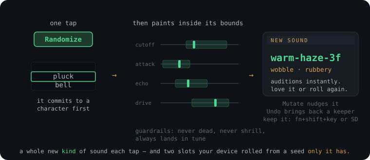
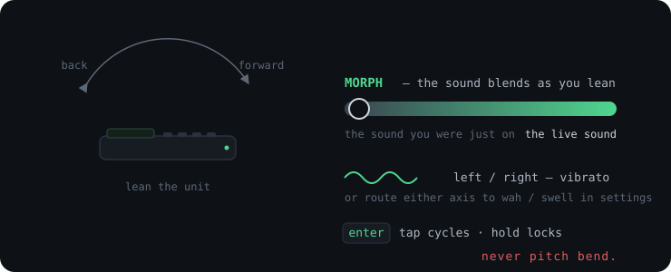

# The GLIDE manual

Everything the instrument does and how to play it. For install and the five-minute intro, see the [README](../README.md).

## The keymap

```
 string 3 (hi) |  1  2  3  4  5  6  7  8  9  0  |  - oct-   = oct+   bksp PANIC
 string 2      |  q  w  e  r  t  y  u  i  o  p  |  [ bend-  ] bend+  \  tap tempo
 string 1      |  a  s  d  f  g  h  j  k  l  ;  |                   enter tilt
 string 0 (lo) |  z  x  c  v  b  n  m  ,  .  /  |  space sustain

 `     restart (HOLD ~0.7s)  fn (hold)    quick-edit layer (Basic: sound picker)
 tab   settings             shift (hold) momentary chromatic
 ctrl/opt volume -/+ (left thumb)        alt loop pedal (left thumb)
                                         (tap rec/play/dub, hold clear, fn+alt undo)
 - / =    octave -/+          G0 (RIGHT trigger, top edge) = trigger macro (wah)

 fn + q..p         : switch between the ten sounds, live
 fn + shift + q..p : save your current tweaks over that slot
 fn + k            : cycle the key (root) up a semitone, live
 fn + s            : cycle the scale, live
 fn + shift + k/s:   the same cycle, backwards (key down, previous scale)
 fn + k  (HOLD)    : LISTEN - the mic hears the song and retunes for you
 fn + a            : arpeggiate the backing - session only

 ADVANCED MODE ADDS
 fn + 1..0         : pick a parameter, [ ] to adjust
 fn + z / fn + x   : arp rate / arp span
 fn + h            : harmony - a second voice above every note, in key - session only
 fn + c            : chord mode - every key plays its whole diatonic chord - session only
 z x c v b n m     : in chord mode on the CHROMATIC scale only - tap one to set
                     the chord: maj min maj7 min7 dom7 dim aug (it latches)
```

## Two modes: Basic and Advanced

GLIDE is one instrument with two depths. **Settings → Mode**, the first row, switches between them: two bubbles, the lit one is where you are.

| | Basic | Advanced |
|---|---|---|
| What it is | The essentials. Every key always does the same thing, and everything you can do is named on the screen. | Everything the instrument can do. Nothing hidden. |
| Sounds | Pick one, roll one, mutate one, keep one. | Open the sound up: ten live knobs, tone, effects, modulation. |
| Harmony | The scale keeps you in key; the backing row plays chords; `fn`+`a` arpeggiates them. | Chord mode, harmony, arp rate, span and swing. |
| Tilt and trigger | On, out of the box. One *Tilt feel* row picks from four ready maps. | Route, depth and reach per axis; a map per sound. |
| Scales | Seven: the two pentatonics, blues, major, minor, Dorian, Mixolydian. | All thirteen. |
| Settings | About two dozen rows. | All of them. |

- **Advanced is Basic plus more.** Almost every Basic gesture does exactly the same thing in Advanced, so nothing has to be relearned. The two that grow are a tap of `enter` and a held `fn` (see below).
- **Switching loses nothing.** Your sounds and settings are the same in both; Basic hides a row, it never resets it. A sound made in Advanced, or loaded from the card, plays in full in Basic.
- **A key that lives in Advanced says so.** Press `fn`+`c`, `fn`+`h`, `fn`+`z`, `fn`+`x` or `fn`+`1`..`0` in Basic and an **IN ADVANCED** card names the feature and where the switch is. Nothing else happens.
- **A new unit starts in Basic.** A unit that updates from an older version asks which you want: two cards side by side, BASIC and ADVANCED, with ADVANCED lit, so `enter` keeps everything as you had it. `,` and `/` move between them and `enter` takes the lit one. Leave it for 30 seconds and the question closes, then asks again at the next power-on.
- **In Basic, holding `fn` shows a sound picker** (the ten sounds, the key and scale) where Advanced shows the knob panel, and a tap of `enter` is simply tilt on / off.
- Going to Basic switches off chord mode and harmony if they were on. If you changed Advanced settings that alter how the instrument plays (jam motion, allocation, row interval and the like), the switch asks whether to keep them or go back to stock.

Sections below marked **(Advanced)** describe things only that mode reaches.

**A note on the two ways out.** Holding `` ` `` saves your work and reboots,
but the Cardputer boots straight back into GLIDE, so what you actually get is
the splash again, not Launcher. To reach Launcher, press the **left trigger on
the top edge, marked `BTN RST`**, and tap any key as the device comes up. (The
*right* trigger is G0, GLIDE's own trigger macro, and never restarts anything.)

## How you play it

- Press keys. It sounds good immediately. Scale lock is on by default (A minor pentatonic, degree-mapped: every key is a scale tone, no dead keys, and sliding a shape sideways is a diatonic transposition). You can't really hit a wrong note. That's on purpose. It's the same thing that happens when you connect the pentatonic boxes across a guitar neck.
- **Hammer-on:** press a new key on the same row while holding one and the voice glides there. **Pull-off:** release it and the voice glides back. Each row behaves like a real string.
- **Slide a chord:** hold a shape across rows, then re-finger it elsewhere while the old notes still ring. Every voice glides. This is the thing.

  
- **Hold `shift` to break out of the scale.** Pure chromatic semitones, only while held. That's the skill gate. The scale keeps beginners safe; shift is how you earn the notes in between.
- **Match a song's key on the fly with `fn`+`k`.** Each tap walks the root up a semitone (wrapping at B); add `shift` and it walks down, so A to G is one tap and not eleven. Step the key, play a phrase against whatever's on, and step again until it locks in, with no trip to settings. The current key shows on the status bar and flashes in the HUD on every tap.
- **Change the mood with `fn`+`s`.** The same audition loop for scale color: each tap walks the scale table (pentatonics, the modes, blues, exotics; the HUD names each in full, and `shift` walks it backwards), held notes keep ringing, and new notes land in the new scale. Key and scale together are the whole "play along with anything" gesture, and they live under one finger.
- **Or let the instrument find it: hold `fn`+`k` and it LISTENS.** The synth goes quiet while the mic hears whatever's playing in the room, in ~3-second rounds, stopping once it's sure and has heard at least five seconds, listening up to ~9 s when the song is being coy (a single round can land on one chord and name *its* key; more rounds hear the changes). A chromagram works out the song's key (root *and* major/minor), and the instrument retunes itself. It hears the *mode*, not just major-or-minor: the degrees that separate Dorian from minor and Mixolydian from major are read straight from the capture, and a two-chord vamp that fools the textbook reading (an Am7-D9 groove scores as "D major" as honestly as "A minor") gets its tonic re-seated where the song actually lives. The verdict then lands the song's own key and mode at its tonic (Major, Natural minor, Dorian or Mixolydian, exactly as heard), whatever scale you were in before you held the key: what you were playing is not evidence about the song, so it never shapes the answer (it used to; a Blues player could never get out of Blues). Weak evidence changes nothing, since mode and tonic corrections sit behind stricter gates than the key itself. The same capture reads the song's tempo from its onsets: a confident beat sets the jam clock (the synced delay and LFOs follow), a beatless room leaves it untouched, and the card shows the locked BPM. And when a song refuses to pick a side (it audibly plays *both* sixths, or a note your scale asserts is one the song contradicts, like a Lydian #4 or a Phrygian b2), the landing retreats to the pentatonic at the tonic, which simply omits the clash note: when unsure, play fewer notes rather than a wrong one (the card says "clash heard - safe pent"). A listen that runs its whole budget without ever getting sure retreats the same way ("unsure - safe pent"). While it listens you watch the twelve pitch-class bins fill in real time, pulsing as each round lands, with its forming verdict underneath. The result card shows the bars it heard, the detected key and mode, a confidence meter, and the applied root, with an amber strip marking which notes your applied scale contains; a weak or silent room says NO SIGNAL and changes nothing. The card is a playing surface, not a wall: it holds for about six seconds and the keyboard stays live underneath it, so you can play the key it just named while you are still reading the verdict. A running loop and any jam motion keep going too. If the verdict is *close but not quite*, or you want fewer notes, tap `space` while the card is up to walk the second guesses: the relative twin first (same notes, the other home), then the detector's two best runner-up keys (the fix when the tonic itself landed wrong), then that key's pentatonic, then its blues, then two more runner-up keys as long shots. Each is applied live as you cycle, and each press handing you a fresh six seconds to judge it; `` ` `` or `enter` keeps what's showing and dismisses early, and tapping `fn`+`k` again re-listens. (Cardputer ADV only, since it needs the mic; no mic just means a visible "mic unavailable", never a broken instrument.)

  
- **(Advanced) `fn` + top row** picks a parameter (glide, ADSR, wave, cutoff, voices, bend range, volume); `[` `]` adjust it live. Nothing is hardcoded. Every sound parameter has a control, and everything survives a reboot.
- The **oscilloscope** is live. That's the actual output waveform, with a phosphor afterglow. The note readout tracks the lead voice in cents *through* glides and bends, so you can see exactly where you are between the notes.
- Or flip the display to the **pitch trail** (settings → *Display*): the lead voice's pitch drawn over time, scrolling across ~7 seconds, with root-note gridlines as fret markers. On an instrument about the space *between* notes, this is the scope for the other axis. Every glide, hammer-on, and bend becomes a visible curve (bend-pulled segments draw amber), and with tilt-vibrato on you can watch the line shimmer.

## Your sounds are yours

This is the other half of GLIDE, and arguably the bigger one. The factory bank is a starting point you grow past.

Ten slots live on `fn`+`q`..`p`. Eight are a curated bank, led by **GLIDE** on `q` (the home/boot sound) and **ACID** on `w`. The last two, `o` and `p`, are **generative**: rolled from a seed unique to your unit, so they're different on every device on Earth. From there you build your own.

| key | sound | character | tilt (per-sound mode) |
|-----|-------|-----------|-----------|
| q | **GLIDE** | the signature saw, now with a body: synth brass that swells into each note. the literal boot tone | filter (roll: vibrato) |
| w | **ACID** | resonant squelch. lean into it, tilt is the wah | filter (full) |
| e | **Organ** | drawbar organ with a leslie shimmer. holds a chord forever and sits *under* a solo: the bed | filter (roll: vibrato) |
| r | **Taser** | open saw + sub. gets *darker* as you play up, and leaning swells the echo | vibrato (roll: filter) |
| t | **Crisp Horn** | bright reed horn that sings its own vibrato without you leaning | filter (roll: vibrato) |
| y | **Slappy Brass** | saw brass that swells into each note, a dotted-eighth slap echo and a room behind it | vibrato (roll: vibrato) |
| u | **Hollow** | driven square through a *notch* filter, phasey and hollow | volume swell (roll: filter) |
| i | **Big** | highpass square ringing at the corner: hollow and enormous at once, on a 1/4 echo | filter |
| o | *generative* | rolled unique to your device, yours alone | (rolled) |
| p | *generative* | rolled unique to your device, yours alone | (rolled) |

A `*` in the `fn`+`q..p` list marks a slot holding *your own* sound. A `*` on the top status bar means the live sound has **unsaved edits** (shift-save to keep them). *Sound reset* restores one slot; *Reset all sounds* (Advanced) brings the whole bank back.

The bank is just the floor. The point is **rolling your own**:

<p align="center">
  
</p>

- **Randomize.** A whole new patch in one tap, and a whole new *kind* of patch. Every roll first commits to a character (a pluck that stops, a bell that rings, a pad that swells, a sub-heavy bass, an acid squelch, a singing lead, a brass swell, a chip trill, a breathy slide whistle, a rotary organ, a tine piano, a tempo-locked wobble bass, a bowed string section, a held-forever drone, a tempo-chopped gate, or pure chaos), then paints everything inside that character's musical bounds, and inside one of that family's *styles* (so two plucks can be a kalimba and a muted funk stab rather than two shades of one preset), with guardrails so a roll is always playable: never dead, blown out, or warbling off-key. Two presses never repeat a family back to back. Roll till you love one.
- **Mutate** (with **Mutate amt**, Advanced). Don't start over, evolve what you have. A gentle mutate is a neighbour, same character nudged. A wild one rewrites it. Sculpting toward a vibe instead of pulling a slot machine.
- **Undo / Redo.** Every roll, mutate, and init checkpoints first, so you can always step back to the sound you just had. Experiment without ever trashing a keeper.
- **Init sound** (Advanced). A blank, neutral sound to build up by hand.

Every action auditions on the spot with a short fixed lick, so you can A/B two rolls by ear. It all opens *first* in settings, as two big **Randomize** and **Mutate** buttons at the top of the **CREATE** section. (Settings is a collapsible accordion now, with only CREATE unfolded on open so the whole map fits at a glance.)

**Keeping what you find, two ways:**

- **Fast:** `fn`+`shift`+`q`..`p` saves the live sound onto one of the ten slots. Your quick-access favourites.
- **Unlimited:** **Save to SD** writes the sound to the microSD as a `.gpat` file. It asks what to call it, with the sound's own auto-name (`warm-haze-3f`, `frost-choir-1a`) already in the box, so `enter` keeps the rolled name, or you type over it and the sound is called whatever you want. **Load from SD** browses your whole library back (and renames anything there later). The card holds as many sounds as you'll ever roll, they're named so they read as *yours*, and because every file uses the same tagged format as the slots, the library survives firmware updates and travels card-to-card. (No card? The instrument still plays perfectly. SD only grows the library past ten.)

**Re-roll bank** (Advanced) resets the slots to the curated presets and rolls fresh randoms for `o` and `p` from a new seed. New sounds whenever you want them, presets intact. *Reset all sounds* (Advanced) is the way back without changing the seed.

Under the hood every sound rides five engine character-makers: a paraphonic **filter envelope** (retriggered by fresh attacks, never by legato hand-offs, so slides stay smooth), a **sub-oscillator**, env-gated **noise**, **drive** into the soft clipper, and built-in **vibrato**. All of it editable live and saved per slot.

## Tilt

The gyro debate, resolved as agreed, then promoted, because in practice it's fantastic. Tilt is an *assignable* effects modulator, toggled with `enter`, and **never pitch bend** (nobody wants to lean the instrument over again).

<p align="center">
  
</p>

- **Your rig, or the sound's.** By default the tilt map is *global*: forward/back and left/right each hold a route that follows your hands across every sound instead of resetting per patch. Out of the box that's **Morph on forward/back** (lean into the sound you were just on) at 90% and **vibrato on left/right** at 60%. On the morph route, settings → *Tilt reach* (Advanced) is how far you lean for the other sound to fully arrive: 60 degrees out of the box, where you can still read the screen, anywhere from 20 to 90. A few degrees around flat do nothing, so a steady hand doesn't wobble the timbre. Depth still scales it: above the stock 90% the other sound arrives a little sooner, below it later, and low enough that the lean tops out short of the other sound. Set it once and play. Flip settings → *Tilt map* (Advanced) to **per sound** and each patch carries its own route and depth instead (ACID into a full wah, Taser into vibrato, per the table above), saved with the slot.
- **Depth** (settings, Advanced): how hard the motion drives the effect, 0 to 100%.
- **Tap `enter`** to switch tilt on and off. In Advanced the tap has a middle step, forward/back only, before both axes. The HUD names each step.
- **Tilt feel** (settings → TILT): four ready-made maps on one row: morph + vibrato (stock), filter + vibrato, swell + vibrato, vibrato only. In Basic it is the whole tilt setting; in Advanced it loads a starting map for the routing rows under it. A map you built yourself reads *custom*, and leaving it takes a second tap: the row asks *SURE? tap again* first, since Basic cannot build that map back.
- **The tilt slider** sits under the scope, on the lowest line, and shows what leaning does. When tilt morphs, it reads the live sound's name, a small track, and the other sound's name; the knob slides along the track as you lean toward that sound (it also moves for a G0 synth morph, and while a sound switch glides home). With forward/back on cutoff or volume it names that route over a meter that sits at the centre when you hold the device flat. Vibrato needs no slider, since the pitch trail already wobbles, and with tilt off the line stays empty.
- **Hold `enter`** to freeze tilt where it is (the HUD says *latched*). Lean into a blend or a wah, hold, then set the device down and play with both hands. Hold again and tilt goes live.
- **Morph time** (settings, Advanced; off or 50 ms to 2 s, 300 ms out of the box): how long a sound switch takes to glide into the new sound, and how fast a G0 *synth morph* sweeps. *Off* snaps.
- **Center calibration** (settings → *Tilt center*): "flat" becomes wherever *you* hold the thing, not wherever gravity says. Set it while holding the device in playing position.

## The layering jam (drones)

The brainstorm's "one hand plays the backing, the other solos over it," solved the way continuous-pitch instruments always have: with **drones** (sitar, bagpipes, hurdy-gurdy lineage). Settings → *Backing row*:

- The bottom one or two rows become **tap-to-latch drones**. Tap a key and it rings in the backing register, hands-free, until you tap it again. Lay down a root, or root and fifth, and solo on the rows above.
- **Jam octave** (settings, Advanced) is where that backing register sits relative to the grid, from two octaves under to two over. The default is one octave *over*: an octave under the grid was a fine bass pad on headphones but inaudible mud on the built-in speaker whenever the solo rows were somewhere playable, and the fix was always "shift up two octaves, tap the chords, shift back down". Now the row just sits there. Go under for the old bass pad. Above C7 the backing folds down an octave at a time instead of turning into a whistle, and the setting row says so when it does. It applies to drones and to the chord progression alike, and it auditions live: change it while a jam runs and the chord glides to its new register.
- Drones are protected. They don't count against the lead's voice cap, and chord-slide stealing can never grab them. Your backing survives anything your solo hand does.
- The backing is *pitch-stable*: bend keys and tilt vibrato move only the solo layer. Your fretting hand bends strings; the open strings keep droning. (Drones do keep the patch's own built-in vibrato. That's part of the sound.)
- Release one and it fades with a long tail instead of stopping dead under your solo.
- The backing is visible. Latched drones show **steel blue** on the mini grid-map (held notes stay green) with a `+n` count beside it, and jam motion blinks each struck key white on the beat so you can watch the arp walk.
- Octave shifts sweep the drones along with everything else. Panic (bksp) clears them.

On by default (bottom row) with the **progression** motion ready, so out of the box you tap a chord loop on the bottom row and solo on the three above. Turn *Backing row* off for a plain uniform grid.

## The loop pedal

The other half of "one hand backs, the other solos": **alt** (left thumb, since space already covers sustain) is a one-button looper. What it records is the *performance*, not the audio. The note events themselves, replayed through the live engine.

- **tap**: the metronome **counts you in** (four clicks, the first one brighter), and recording starts on the downbeat after them. That happens whether the metronome is on or off; with it off you get just the four clicks, then quiet. With it already running, the count joins the click you are already playing to rather than restarting it under your thumb. A chord struck a hair before the downbeat (in the count's last half beat, at most 150 ms) is recorded *on* the downbeat. Tap again during the count to cancel it. **tap again**: the loop closes on the bar line and plays. **tap again**: overdub a layer; once more seals it.
- **hold** (~0.7 s): clear the whole loop and start over. It's performance state, so there's no confirm; the hold just sits far enough past a normal overdub tap that a lingering thumb can't nuke the take.
- **fn + alt**: peel the last overdub (undo). Repeat the chord and it walks back up the stack; the gesture bounces at the ends, so it undoes to the base take and redoes to the top. The base loop is protected. You only ever peel the dubs you stacked on it. The annunciator shows the audible layer count (`x3`, or `x2/3` while peeled).
- **panic** (bksp) silences the loop but keeps the take, including a take you've closed that is still rolling on to its bar line. Tap alt and it counts back in, then plays from its downbeat.
- If the screen freezes for a moment (a slow SD save), the loop and the click pick up in time afterwards. They skip what came due during the freeze rather than firing it all at once.
- The hint line goes loop-aware while a take exists (`alt dub  hold clear  fn+alt undo`), so the gestures are always on screen.
- Because the loop is events, it costs kilobytes. The good part: it **keeps the sound you recorded it on**. Record an Organ line, switch to Taser, and solo over it: the loop holds the Organ while Taser becomes your solo voice (the same split as the chords, see *Soloing over the jam* below). Recorded slides, hammer-ons, and octave sweeps replay as slides, hammer-ons, and sweeps.
- Loop playback is a protected backing layer like the drones. Its voices ride outside the voice cap, can't be robbed by chord-slide stealing, ignore live bends and tilt vibrato, never hijack the note readout, and survive sound switches and settings trips. It plays apart from your hands, so a looped note can never collide with one you are holding.
- Timing belongs to the sound engine, not the screen: every note comes back within a few milliseconds of where you played it, so the loop never swings with the display.
- **The loop locks to the jam clock.** The tap that closes a take snaps its length to the nearest **bar** of the *Tempo* (minimum one bar; a tap 40% into bar one was meant as a 1-bar loop), so the loop and the auto-progression share one clock instead of drifting apart a little more every cycle. The loop then starts **on that bar line, not on the tap**: close a little late and the notes you played past the line wrap to the downbeat, and the loop carries on from the line as if you had tapped dead on it. You hear the loop straight away: the chord you started the take with comes in on the tap rather than a whole pass later, even when the tap lands a moment after the beat. Close a little early and it keeps recording up to the line (the hint says *recording to the bar line*), so the fill that leads back round stays in the take. Tap once more while it rolls on to the line and it goes straight into an overdub from the loop point (tap again to change your mind). The loop point is seamless: a chord you hold out over the line keeps ringing across it into the next pass, and lets go where you let go of it, or where its key strikes again in the loop if you held it all the way round (a chord held for the whole bar just re-strikes on the downbeat, with no gap before it). Letting go a frame early, as a hold "to the bar line" often does, still counts as holding over it when the same chord comes back on the downbeat. Settings → *Loop snap* picks `bar` (default), `beat`, or `off` for the old free-time behaviour.
- **The loop and the metronome keep one time.** A snapped loop hands the click every beat from its own playhead, with beat 1 of the bar on the loop's downbeat. Chords you played on the click stay on the click however many times the loop comes round. (They used to keep separate time and slowly slid apart.) Change the tempo while a loop plays and the loop keeps its length while the click goes back to running on its own at the new tempo. A `Loop snap: off` loop doesn't steer the click either, since it isn't a whole number of beats.
- Status sits under the scope, bottom-left, on the line above the tilt slider: **COUNT 1** to **4** in amber through the count-in, **REC** blinks red with elapsed time, **LOOP** green with a cycle-progress bar, **OVR** amber while layering, dim `LOOP --` for a stopped take. `FULL` means the take hit the 1024-event ceiling.

Loops are performance state. They live until cleared or power-off, and never hit flash.

## The chord progression (the easy way to back yourself)

The loop pedal records a *performance*, which means your timing has to be right, and a loop is one phrase, not a chord change. The drones fixed the timing problem (tap to latch, no rhythm) but a drone is one chord forever. The **auto-progression** is the missing middle: a soft chord progression you spell with no timing at all, then solo over. Settings → *Jam motion: progression* (needs *Backing row* on). Progression is the stock motion, so Basic always has it; the *Jam motion* row itself is Advanced.

- **Tap the chords in order on the jam row. That's it.** Each tap appends a step (repeats allowed: I-IV-V-IV is four taps). No pocket to hit, and if you want a click to build against, the metronome (`fn`+`\`) locks to the same clock. The HUD confirms each one (`PROG  3: E`).
- **The sounding chord names its harmony.** The PROG readout boxes the current step and adds its Roman numeral (`F# vi`): uppercase major, lowercase minor, `°` diminished. The progression teaches itself as it plays, in the same system every theory book uses.
- The beat clock walks the steps **one chord per bar**, looping, at the *Tempo*. *Chord length* (Advanced) sets the beats per chord. The backing glides from chord to chord (of course it does) and re-blooms each bar, so on a pad or strings patch it's a soft wash you solo straight over.
- Each step is a **diatonic triad** built from the current scale: real major/minor/dim color, and always in key. The same "you can't hit a wrong note" guarantee the melody gets, now for the backing too. (Hold `shift` while tapping a step for a chromatic power-chord voicing instead. In the *Chromatic* scale every step is voiced that way, on the exact note you tap, since a chromatic scale has no key to build triads from.)
- It's a protected backing layer like the drones and the loop: cap-exempt, steal-proof, ignores your bends and tilt vibrato, and **re-voices through whatever sound you switch to** mid-jam. Lay down Organ, solo on Taser.
- The progression is on screen: a strip of chord chips (`A  D  E`) on the line above the loop's, with the current chord boxed (a long progression scrolls to keep it in view), and its root outlined on the grid-map so you can watch the changes walk.
- **bksp (panic)** clears the progression to start over, the same gesture that clears the drones. Like them, it's performance state and never hits flash.
- **`shift`+`bksp`** takes back just the last step you tapped, for the chord you hit by mistake. The chord playing now finishes its bar, then the loop carries on without that step.

Pick Organ, Hollow, or Big for the bed, set a slow tempo, tap four chords, and you've got a song to solo on in about ten seconds.

## The arpeggiator (the progression, one note at a time)

The progression is the chord half of an arpeggiator already: a tap on the jam row builds a real in-key triad and walks it per bar. `fn`+`a` is the other half. It does not change what the jam row *means*, only how the backing *sounds*: while it is on, whatever chord the row holds is broken into notes instead of sustained.

- **`fn`+`a`** cycles `up` → `down` → `up/down` → off (the `fn`+`k` / `fn`+`s` habit). Nothing sounds until there is a chord. This ring runs **forwards only**, unlike key and scale: on the Cardputer's scan matrix `fn` shares a column with `A` and `shift` with `S`, so holding `fn`+`shift`+`A` closes a circuit that makes the keyboard report `S` as well: the two chords are identical by the time the firmware sees them. The scale keeps `shift`, having thirteen entries to walk; the arp's ring is four, so the long way round is three taps. `fn`+`shift`+`A` is therefore read as `fn`+`shift`+`S` and steps the scale back.
- **Tap one bottom-row key** and that chord goes root-3rd-5th-octave (1-3-5-8, always in key), hands-free, looping every bar. Solo on the three rows above. The first chord takes a one-beat count-in rather than starting under your finger, so the walk begins on the grid and a quick run of taps lands in time. With the metronome on, the count-in lands on the click's next beat, so bar one starts with the click instead of fighting it.
- **Tap three more** and you have four chords; each bar the arp moves to the next one. The chord strip under the scope leads with `ARP^` (`ARPv`, `ARP^v`) and boxes the sounding chord with its Roman numeral, exactly as before.
- **(Advanced) `fn`+`z`** steps the note rate (`1/8` → `1/8T` → `1/16` → `1/4`) and **`fn`+`x`** flips the span (one octave, or two: 1-3-5-8-10-12-15). Both work with the arp off too, so it arrives already tuned. Speed itself is the *Tempo*: tap it in on `\` and the arp follows.
- **Swing** (settings → JAM / BACKING → *Arp swing*, Advanced): the walk's notes pair up long-short, the bounce of a shuffle or a swung drum machine. The steps are the classic drum-machine values, 50 to 75%, so you can match a machine's number: 50% *straight* (out of the box), 58% *light*, 66% *shuffle*, 75% *heavy*, and 54, 62 and 71 between. Only the second note of each pair moves, so the beat, the click and the chord changes stay exactly where they were. It swings the `1/8` and `1/16` rates; `1/8T` is already a shuffle and `1/4` stays on the click, so both play straight. While the arp swings, the strip's tag gets a `~` (`ARP^~`) and `fn`+`z` names the feel (`1/8 shuffle`). The setting is kept, like the tempo; the arp itself still starts off at every boot.
- Cycling back to **off** returns the pads; the progression survives. `bksp` clears the chords and leaves the arp armed, like the metronome.
- **It never survives a restart.** The arp is session state, the same as the metronome: a mode you fell into by accident and can't find your way out of is exactly what the old latching chromatic toggle got wrong, so every boot starts with it off, and while it is on the strip says so.

Everything else is inherited from the progression: shift octave or key and only the solo moves; switch sound over it and the backing holds its own (`SOLO`); the metronome locks to each chord change; *Jam octave* re-voices it live. The notes are clocked on the audio engine, not the screen, so sixteenths land where sixteenths should. If *Backing row* is off, `fn`+`a` says so and names the setting instead of arming a row that isn't there. (The older *Jam motion: arp*, one latched drone per beat, is still there in settings; `fn`+`a` is the arpeggiator.)

## Soloing over the jam: a separate register and sound

Once the backing is looping, you don't want to be stuck in its octave or its sound. You want to *solo* over it. So the moment you change the solo while a jam runs, the backing holds its ground:

- **Different register.** Shift octave (or even change key/scale) and only your **solo** moves. The progression keeps looping in the register and key it was built in. Build a progression, then shift the solo wherever it sings over it.
- **Different sound.** Switch patches (`fn`+letter) over a running jam and the backing freezes onto the sound it was playing while the new patch becomes your solo voice. Lay down an Organ progression, flip to Crisp Horn, and wail over it. The organ keeps holding. A steel-blue **`SOLO`** badge in the top bar (and on the sound card as you switch) tells you the split is engaged.
- **Their own voice, a shared room.** The backing and the solo each keep their own oscillator, filter, envelope, and drive, but they wash into one shared reverb/delay space (the solo patch's), so the whole thing sits together instead of sounding like two unrelated machines.
- **`bksp` (panic)** clears the jam and drops the split. The next sound switch goes back to changing everything, as normal.

No new gesture to learn. Start the jam, then change your sound. The split appears when you need it and disappears when the jam's gone.

## Tempo, the synced delay, and the live FX rack

One tempo (the *Tempo*) drives both the progression and the echo. Two things make a solo over that backing sound produced:

- **Tap tempo**, on `\`, right on the keyboard, so you can match a song's groove without leaving the instrument. Tap it in time and the BPM follows your hand; the HUD reads back the tempo on every tap. A single tap after a pause only *reports* the tempo, so a stray press can't move anything; it takes two taps to make a beat. Tapping over a running progression or arp re-phases it to your hand: each tap lands on the nearest beat of the chord at the new tempo, so the chords, the arp and the click all follow the tap together, which is how you lock onto a drum machine. (Also in settings → *Tap tempo* (Advanced), tapped with `,` or `/`; it's the same series either way, so you can start in one place and finish in the other.)
- **The metronome lives on the same key: `fn`+`\` clicks it on and off.** A soft wood-block pulse, timed on the audio engine itself (not the screen), with a brighter tick on beat 1 of the bar. It locks onto your tap-tempo taps as you make them and onto the progression's chord changes, so click and backing land together. While a loop plays, the loop drives it beat by beat, and the loop pedal's count-in is the metronome's too (four clicks, even with it off). `fn`+`ctrl`/`opt` sets its volume (the same thumb keys that do master volume, one layer up); settings → *Metronome vol* (Advanced) holds the level between sessions. The click never records into the looper and always starts quiet on boot.
- **Or let LISTEN set it by ear.** Hold `fn`+`k` at a song and the detected key arrives with its tempo: when the beat is confident the jam clock takes the BPM, and everything synced to it follows. A weak or absent beat moves nothing.
- **Tempo-synced delay** (settings → *Delay sync*, Advanced): lock the echo to a musical division (`1/4`, `1/8.` the dotted eighth and the Edge/Gilmour trick, `1/8`, `1/8T`, or `1/16`) and every repeat lands on the beat. Taser and Big ship with it on; switch to Taser over a progression and the repeats cascade right in the pocket. (Set it to `free` for a plain ms delay.) If a division is too long for the delay line at a slow tempo, it folds down an octave so it stays on the grid instead of clipping.

The whole **send-FX rack is live on-device** (settings → EFFECTS, Advanced): *Chorus*, *Delay send / time / sync / feedback*, *Reverb send / size*. Dial the space to taste and `fn`+`shift`+letter saves it with the slot, like every other sound parameter. The effects were the one thing you couldn't reach before. Now nothing about the sound is off-limits.

## The modulation matrix (Advanced)

Tilt was the first assignable modulator. Now there's a whole rack of them, which is exactly how two players with the same device end up with sounds that share no DNA. Settings → *MOD SOURCES* and *MOD MATRIX*:

- **Two LFOs**, each with a shape (sine / tri / saw / square / **S&H** random) and either a free rate in Hz or a **tempo-sync** division locked to the *Tempo* (same `1/4` to `1/16` vocabulary as the delay), so a wobble or a filter sweep breathes in time with the progression.
- **A second envelope** (attack / decay) that retriggers on each note.
- **Six routing slots.** Each picks a *source* (LFO1, LFO2, mod-env, key-track, bend), a *destination* (pitch, cutoff, resonance, amp, filter-env depth), and a bipolar *amount*. Six slots across those sources and destinations is a huge sound-design space: vibrato, tremolo, auto-wah, growl, evolving pads, random steppers, all from a handful of primitives, all on the lead voice (the backing bed stays steady underneath). Everything defaults to off, so a fresh patch is the original GLIDE tone until you wire a slot.

**Filter modes** (settings → TONE → *Filter mode*): the filter does **lowpass** (the original voice), **highpass** (thin/airy), **bandpass** (vocal/telephone), and **notch** (hollow/phasey), free, because the filter already computes them all.

**Drift** (settings → TONE → *Drift*): every voice wanders in pitch on its own slow random walk, a few cents either side. It is the imperfection that separates a warm analog synth from a sterile digital one. Real oscillators never sat still, and a chord whose notes are *mathematically* identical is a chord your ear reads as fake. It ships on, subtly, because a feature nobody finds is a feature nobody has; turn it to **off** for dead-still digital, or up to 12 cents for something that has not seen a service in years. It is per-voice, so a held chord shimmers against itself rather than sliding as a block. The note readout deliberately does not wander with it.

Every one of these saves with the slot (`fn`+`shift`+letter) and survives a reboot. And because patches use a **tagged format**, adding the next knob, or the one after that, will never wipe the sounds you've already saved. Expansion is the point. The further you get from the default, the more the instrument is *yours*.

### The motion macros

Most G0 actions are a *throw*: you shove the sound somewhere and it stays there
while you hold. Three of them **move on their own**, locked to the instrument's
tempo, so they work with the jam instead of across it.

- **wah**: a resonant peak sweeps 350 Hz to 2.4 kHz, one sweep every two beats.
  It is a real wah, not a tone control: at full depth the filter belongs to the
  pedal, whatever the patch's own cutoff was, and the Q goes right up so the
  peak sings. Both layers sweep, so a held drone breathes with your solo.
- **gate**: the whole instrument is chopped on sixteenths, reverb tail and all.
  Depth sets how deep the chop cuts, from a pulse to a hard stutter. The
  metronome is deliberately not gated; a stuttering click is a broken click.
- **trill**: 16ths alternating your held note with the next scale degree, read
  straight off the grid (the next column on the same string), so it's always in
  key, in every scale, with nothing to clash with. It's in-or-out, not a depth
  knob, since half an interval would be out of key.

Put one on **latch** (*Trigger mode*, Advanced) and it keeps running with your
hands free: hold a chord, tap G0, and play over your own moving texture.
*Trigger depth* (Advanced) is the whole range between
"a hint" and "the point", and both sit still at 0%, so an unpressed button
changes nothing.

### Harmony (Advanced: `fn`+`h`; in both modes as the G0 *harmony* action)

Every note you play brings a second voice up **in the key**: a major third
where the key has one, a minor third where it does not, and on a blue note or a
`shift` press the third that lands back in the scale. The interval never opens
past a fourth, so the harmony line keeps the shape of the lick you play. The
harmony slides with you: a hammer-on, a pull-off and an octave sweep all carry
it along, and it plays the live sound with your bend and tilt. It sits a little
under the melody on purpose, so you can still hear which line is the tune.

In the **pentatonic and blues** scales two notes have no third in the scale at
all (the 4th and the b7), because those are exactly the notes a pentatonic
leaves out. There the partner takes the **fourth** instead of borrowing a note
from outside: in A minor pentatonic the D is harmonized with G and the G with C,
never with F or B. It is the way a guitarist harmonizes a pentatonic lick, and
it is why the harmony stays in the scale you are actually playing. In every
seven-note scale (major, minor, the modes) every note has a third, so those are
thirds throughout, exactly as before.

- **`fn`+`h`** toggles it for the session (`HARM` shows in the top bar while it is
  on) and it is off at every boot, like the arpeggiator.
- As the **G0 action** it is momentary or latched per the trigger mode, so you
  can bring the harmony in for one phrase and let it go.

It doubles the voices you use, so a big chord may steal from itself under the
voice cap; the loop pedal records the notes you play, not their thirds, so a
take stays yours to harmonize live over. Depth has no effect: the harmony is in
or out.

**Wah on latch is what the instrument ships as**, because it is the setting that
makes G0 sound like the instrument is doing something on its own: one tap and it
sweeps until you tap it off. A latch is session state, never saved: however you
left it, a reboot always comes up unlatched.

Tempo comes from the same place the jam and the synced delay read it, so tap
tempo (`\\`) or the BPM setting moves the sweep and the chop with it.

### Chord mode (Advanced: `fn`+`c`)

One key is a chord. On a seven-note scale (major, natural minor, Dorian,
Mixolydian, Lydian, harmonic minor, Phrygian dominant) the key you press sounds
its *diatonic* triad: the note under your finger plus the 3rd and 5th of the
scale you are in. So the I is major, the ii is minor, the vii is diminished, and
every chord is in key without you having to know which is which. It is the same
guarantee the melody gets, applied to harmony: you cannot really play a wrong
chord. Slide a chord shape and the whole triad glides with you, hammer-ons and
pull-offs included.

Five- and six-note scales get no chord mode: you cannot stack thirds out of a
scale that does not have them. A pentatonic or the blues scale is what you
*solo* with, over chords built from a seven-note one, so `fn`+`c` says so and
stays off there, and changing to one of them switches the mode back off rather
than leaving it on and silent.

**On the chromatic scale you pick the chord by hand.** Twelve notes in a row
have no degrees and no diatonic chords, so there the bottom row stops latching
drones and spells the quality instead: tap `z` `x` `c` `v` `b` `n` `m` for
**maj, min, maj7, min7, dom7, dim, aug**. It *latches*, the way a jam-row drone
does: one tap and every note you play is that chord, until you tap a different
one; tapping the same one again clears it back to single notes. So the hand that
spells the chord is free to leave the row and play. Tap `z`, then hold a C and
you get C major; tap `x` while it rings and it turns into C minor, `c` into C
major 7th, re-colouring under your finger without the note ever stopping. The
top bar names what the row is spelling (`maj7`) and the HUD flashes it on
every tap. Only the chromatic scale hands that row over; every other scale keeps
its jam row latching the backing.

Chord mode supersedes harmony (its own 3rd *is* the harmony third), and turning
it on or off reaches the chords already under your fingers. The upper voices sit
under the note you played, at the harmony's level, so the melody still reads as
the melody. A triad costs three voices and a 7th chord four, so raise *voices*
(`fn`+`8`) before stacking chords on chords. Session only, like the arpeggiator
and the harmony (`CHORD` shows in the top bar while it is on).

**The loop pedal records the whole chord.** Loop a chord progression and play
over it: every chord comes back as you played it, the quality you tapped
included, and a chord you re-coloured, slid, or switched off under a held note
does the same on every pass. Once it is in the loop it is part of the take, so
you can change the chord row, leave chord mode, or change scale and solo over
it. (The `fn`+`h` harmony third is still a live layer only, so a take stays
yours to harmonize afresh.)

## Every parameter

In Basic, settings shows these rows: *Mode*, *How to play*, *Randomize*,
*Mutate*, *Undo*, *Redo*, *Save to SD*, *Load from SD*, *Sound reset*, *Root
key*, *Scale*, *Backing row*, *Tempo*, *Loop snap*, *Tilt feel*, *Tilt center*,
*Trigger action*, *Demo mode*, *Display*, *Theme* (with *Roll look* while it
reads *custom*), *Screen idle*, *Tutorial*, *Odometer* and *Reset defaults*.
Every other row below, and everything on `fn`+`1`..`0`, is Advanced.

| param | range | default | where |
|---|---|---|---|
| mode | Basic / Advanced | Basic (an updated unit asks) | settings, the first row |
| glide time | 0-2000 ms | 120 | fn+1 |
| attack / decay / sustain / release | 0-2s / 0-2s / 0-100% / 0-3s | 5ms / 120ms / 70% / 250ms | fn+2..5 |
| waveform | sine, tri, saw, sqr, fat, pwm | saw | fn+6 |
| cutoff / resonance | 80-12k Hz / 0-95% | 4k / 30% | fn+7 / settings |
| voices | 1-8 | 6 | fn+8 |
| bend range / bend time | 1-12 st / 50-1000 ms | 2 st / 250 ms | fn+9 / settings |
| volume | 0-100% | 70% | ctrl/opt (left thumb) or fn+0 |
| root / scale / row interval | C-B / 13 scales / 1-12 st | A / min pent / 4th | fn+k / fn+s (live), settings |
| glide mode | legato-only / always | legato-only | settings (per sound) |
| allocation | strings (mono rows) / free poly | strings | settings |
| backing row (drones) | off / bottom / bottom 2 | bottom | settings |
| jam motion | sustained / pulse / arp (1 drone/beat) / progression | progression | settings |
| tempo / chord length | 40-240 bpm (a tap moves 1, holding moves 4 at a time) / 1-8 beats | 100 / 4 | settings |
| arp swing | 50-75% (straight, light, shuffle, heavy) | 50% | settings (JAM) |
| loop snap | off / beat / bar | bar | settings |
| octave keys | sweep (glide) / re-strike | sweep | settings |
| trigger action / depth / mode | muffle, brighten, pitch dive, drive grit, synth morph, wah, gate, trill, harmony / 0-100% / momentary, latch | wah / 70% / latch | settings (right trigger, G0) |
| sound slots | 10 (q=GLIDE, w=ACID, e..i curated, o/p generative per device) | curated + 2 rolled | fn+q..p, fn+shift+q..p |
| generate | randomize / mutate (+amount) / undo-redo / init / re-roll bank | live | settings (CREATE) |
| SD library | save / load / delete named .gpat patches (unlimited) | live | settings (LIBRARY), browser |
| filter env (atk/dec/depth) | 1ms-2s / 10ms-2s / 0-3+ oct | per sound | settings, saved in sound |
| sub / noise / drive / auto-vib | 0-1 / 0-1 / 1-8 / cents | per sound | saved in sound |
| chorus / delay / reverb send | 0-100% each | per sound | settings (live) |
| delay time / sync / feedback | 10-600ms / free+5 divisions / 0-90% | per sound | settings (live) |
| reverb size | 0-100% (tail length) | per sound | settings, saved in sound |
| fat detune | 0-50 cents (the spread of the *fat* wave's three saws) | 12 | settings, saved in sound |
| mod envelope (atk / dec) | 1 ms-2 s / 10 ms-4 s | 10 ms / 300 ms | settings, saved in sound (a mod-matrix source) |
| tap tempo | 40-240 bpm, tapped | live | `\` key, settings |
| metronome | on/off + 0-100% volume | off / 60% | fn+`\`, fn+ctrl/opt, settings |
| tilt feel | morph + vibrato / filter + vibrato / swell + vibrato / vibrato only (or *custom*) | morph + vibrato | settings |
| tilt map | global (follows your hands) / per sound | global | settings |
| tilt routing (f/b + l/r) | off / cutoff / vibrato / volume / morph | Morph f/b + vibrato l/r | settings; enter cycles off / f/b / both, hold enter latches |
| tilt depth | 0-100% | 90% morph f/b, 60% vibrato l/r | settings |
| tilt reach (morph) | 20-90 degrees of lean for a full blend | 60 | settings |
| tilt center | calibrated "flat" | 0 | settings (hold + set) |
| morph time | off / 50-2000 ms | 300 ms | settings |
| display | waveform / pitch trail / tape / cymatic / string / comb / harmonograph / interference | pitch trail | settings |
| theme | 10 palettes + **custom** | cassette | settings |
| custom: hue / accent / vividness / ground / contrast | full circle / angle from hue / 0-100% / black..bright / 0-100% | fitted to the palette you left | settings (only while theme = custom) |
| screen idle | off / dim / dim + screensaver | dim + screensaver | settings |
| solo/backing split | auto when you change sound/octave over a jam | live | live |

### Making the palette yours

Ten palettes ship with the instrument. The eleventh, **custom**, you turn yourself.

It is not eleven colour pickers. It is five dials, and the rest follows:

- **Hue**: the instrument's colour. Turn this one dial and the whole palette
  rotates with it, because everything else is defined *relative* to it.
- **Accent**: the angle from that hue to the annunciator colour. The row names
  the relationship (*same*, *near*, *wide*, *triad*, *split*, *opposite*) rather
  than a number, because the relationship is what you are choosing, and it
  survives turning Hue.
- **Vividness**: how saturated the whole thing runs.
- **Ground**: the stock, from *black* through *dusk* and *ash* up to *paper* and
  *bright*. Cross into the light half and GLIDE flips its whole colour model:
  ink pools instead of light summing, and every screen stays right.
- **Contrast**: how far the ink sits off the stock.

Two things worth knowing. Cycling onto *custom* from a palette you liked opens
it as a **copy of that palette**, so you start from something good rather than
from a jarring default. Nudge it from there. And **Roll look** rolls a whole
coherent palette at once, the same bargain as the sound randomizer: you do not
have to want to design anything to end up with an instrument that is yours.

The dials appear only while the theme reads *custom*, and only in Advanced
(Basic keeps *Roll look*); nothing changes for
anyone who never opens it. You cannot make GLIDE unreadable with them: every
combination is held to a minimum contrast against the stock, so the worst you
can do is a palette you don't like, never one you can't play. And because the
whole recipe lives in the device's own storage rather than in the firmware, it
survives every update: a custom palette is yours to keep.


## The instrument teaches you

Real players kept missing the gestures above (`fn`+`k`, `fn`+`s`, the LISTEN hold, even Randomize) for weeks, because a pocket instrument has no manual in your hand. So GLIDE now teaches with *your* hands, three ways:

- **The tour.** A ~60-second playable ritual: a banner along the bottom asks for one gesture at a time (press a key → the slide → `fn`+`k` → `fn`+`s` → `fn`+`w` → Randomize → the LISTEN tell, and in Basic a last card pointing at the Mode row) and advances only when your fingers actually do it. The instrument keeps playing normally the whole way through. A fresh unit boots straight into it (it replaces the old intro card); a unit that updated, and has never taken the tour, is offered it with a card at power-on (`enter` starts, any other key passes). `` ` `` skips at any point, and settings → *Tutorial* replays it. It's also the thing to hand a friend with the device.
- **The Advanced tour.** Every time you switch to Advanced, the switch card offers a short second tour (`enter` shows you, any other key skips): a sound knob, harmony, chord mode, then a card for the rest.
- **One-shot tips.** The coach watches for the moment a gesture would have helped and names it exactly once, ever:
  - play a lot of off-scale (`shift`) notes and it mentions `fn`+`k` / `fn`+`s`;
  - go a few boots without touching the sound slots or Randomize and it points them out;
  - spell a chord progression and keep soloing over it, and it suggests `fn`+`a` to arpeggiate it;
  - roll several sounds in one session without ever saving one, and it shows `fn`+`shift`+`q`..`p` to keep the one you like;
  - in Basic, reach for Advanced gestures a few times (or settle in, ten boots and a sound of your own saved), and it mentions, once in the unit's life, that *Mode* adds chords, sound knobs and effects.

  A tip never repeats, never fires twice a session, and retires silently the moment you use the gesture on your own.
- **The hints know the layer.** While `fn` is held, the bottom line spells the whole layer (`q-p sound  k key  s scale  hold k: mic`), and the resting hint line alternates between the classic `fn edit  tab setup...` (in Basic, `tab: new sounds + setup`) and the fn-layer headliners. *How to play*, the full scrollable cheat sheet, is the second row of settings, a quiet link right under *Mode*.

## Persistence and reset

**Your saved sounds live on the microSD card.** Saving over a slot (`fn`+`shift`+letter) writes a file in `/glide/slots/` on the card, in the same `.gpat` format as the library, so a slot, a library patch, and a Discord attachment are all the same thing. No card in? The instrument plays exactly the same (the ten slots fall back to their factory and generative sounds, and everything about *making* sound is card-free); only saving asks for a card, and it says so in plain words: **no SD card: insert a card to save sounds.** Pop the card back in and your slots return, mid-session, no reboot.

Settings and the live working sound persist on the device itself, so they survive reboots, firmware updates, and card swaps. That sliver of flash is shared with the Launcher and every other app, and since v2.8 it **manages itself**: GLIDE keeps its footprint tiny, quietly mirrors your settings and live sound to the card, and if another app ever fills the shared space, the next boot cleans it out and restores everything automatically. You'd see a green **STORAGE FIXED** screen (*Nothing to do - play on.*) for two seconds, and that's the whole event. (Settings → SYSTEM → *Storage*, an Advanced row, just reads `OK`.)

Settings → SYSTEM → **Demo mode** makes the instrument play itself: it spells a chord progression, improvises over it with slides, and wanders through the sounds. Press any key on the grid and the melody stops while the backing keeps looping, so you are simply playing over it. Handy for a table at a show, or for hearing what the instrument can do before you know how.

Settings → SYSTEM also keeps the **odometer**: a quiet lifetime count of the notes you have struck and your hands-on hours. No goals, no streaks; just the instrument's life with you. It is a record, not a setting: it survives every reset below, the factory one included. Three ways back:

- settings → *Sound reset*: current slot back to factory
- settings → *Reset defaults*: all settings back to factory (saved sounds kept)
- **press and hold backspace during the boot splash:** full factory reset: settings and the ten slots (the card files too, so the reset means what it says), while your `/glide` library on the card is never touched. Hold it through the red confirm bar (~1.5 s); release at any point cancels. Deliberate on purpose, since a stray tap used to wipe people's sessions. It has to be a press made *during* the splash and then sustained; the ADV's keyboard chip is event-driven and can't see a key held from power-on. If device storage is truly wedged it escalates to erasing and rebuilding the whole shared partition (your two generative slots keep their identity, and the odometer rides across); other apps' settings and the Launcher's saved Wi-Fi networks are cleared with it and rebuild their defaults on next use. Day to day you should never need this; storage looks after itself.

---

Stuck, or want to share what you've made? **[Join the Discord](https://discord.gg/uRcuJGCeHG)**: patches travel as plain `.gpat` files, so trading sounds is just dragging an attachment onto your SD card.
